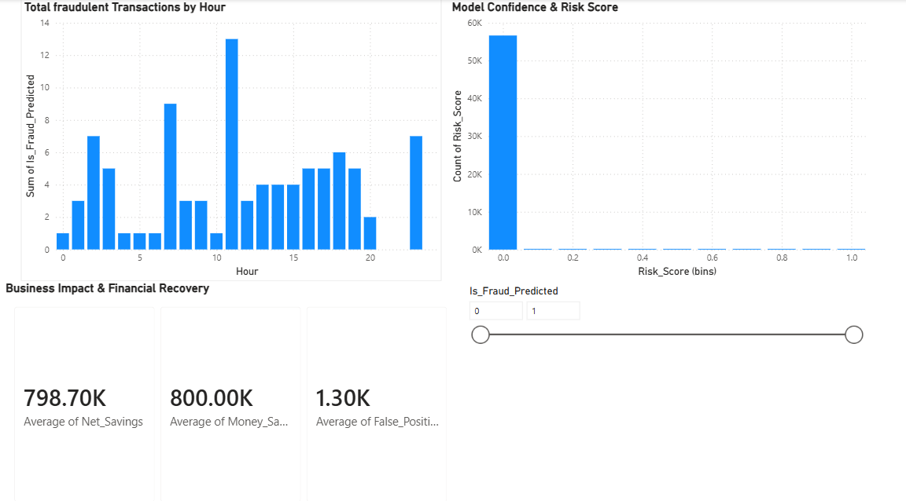

# Credit Card Fraud Detection

### Overview
Developed a Random forest classification model to detect fraudulent credit card transactions, successfully identifying high-rsik patterns to mitigate financial loss.

### Dashboard Analysis

###  Key Features
* *Machine Learning*: Implemented a Random Forest model to predict fraudulent activity with high precision.
* *Data Insights*: Automated feature importance analysis, identifying key transaction drivers like V14 and V4.
* *Interactive Visualization*: Designed a Power BI dashboard to monitor model confidence and financial risk.
* *Professional Workflow*: Organized with a modular project structure and automated dependency management via requirements.txt.
